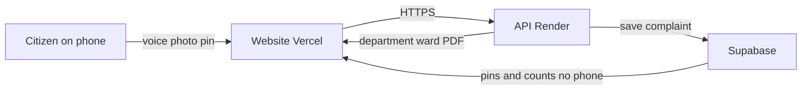

# ARCHITECTURE: Nagrik Mitra

## 1. Executive Summary & One-Slide Diagram (PPT)

### Title: Nagrik Mitra — speak, and get the right complaint letter

**Four-Line Overview:**
1. The citizen speaks in Marathi or Hindi, or adds a photo and a map pin.
2. The website on Vercel sends that to our API on Render.
3. The API names the department, finds the ward, and writes a Marathi or Hindi PDF.
4. Supabase stores the complaint. The public map shows the pin and the ward count, never the phone number.



**What sits inside the API box (Render):**
- **Understand the complaint:** Gemini or Claude (JSON mode), with deterministic keyword backup if AI fails or times out.
- **Voice backup:** Groq Whisper (whisper-large-v3-turbo), used only if the phone browser mic cannot transcribe via Web Speech API.
- **Map:** Nearest Pune municipal ward centroid matching (Haversine < 25 km), plus Nominatim reverse geocode address lookup.
- **Letter:** WeasyPrint PDF engine with bundled Noto Sans Devanagari typography.

**What we do NOT put on this slide (Out of MVP Scope):**
- Citizen login / passwords / OTP authentication.
- Payment gateways / fee processing.
- Direct automated submission into internal PMC ERP systems.
- Categories beyond the 3 supported civic issues (`pothole`, `garbage`, `ration_card`).
- Citizen email handling (MVP collects only name and 10-digit mobile phone; email is dropped from active backend schema).

---

## 2. Technology Stack

| Layer | Technology | Role & Justification |
|---|---|---|
| **UI Design** | **Google Stitch** | High-fidelity screen designs, civic tokens, exported HTML/CSS. |
| **Frontend** | **React 18 + Vite + TypeScript** | Built by Antigravity; Tailwind CSS, Leaflet (`react-leaflet`). |
| **Backend** | **FastAPI (Python 3.11)** | Built by Cursor; async API, Pydantic v2 validation, slowapi rate limiting. |
| **Database & Storage** | **Supabase (PostgreSQL 15)** | Tables, RLS, Storage buckets (`complaint-images` public, `complaint-pdfs` private). |
| **Backend Hosting** | **Render (Docker Web Service)** | Debian base with Pango, Cairo, HarfBuzz for WeasyPrint Devanagari PDF rendering. |
| **Frontend Hosting** | **Vercel** | Static Vite SPA hosting with client-side rewrites. |
| **Speech-to-Text** | **Web Speech API + Groq Whisper** | Primary: in-browser `mr-IN`/`hi-IN` STT; Fallback: server-side Groq Whisper API. |
| **AI / Classification** | **Gemini 1.5 / Claude 3.5** | Categorization, severity assessment, bilingual summaries in JSON mode. |
| **Geocoding & Maps** | **OSM + Nominatim** | Draggable Leaflet pins; server-side reverse geocoding with 1s throttling & cache. |
| **PDF Generation** | **WeasyPrint + Jinja2** | A4 municipal complaint letters with bundled Noto Sans Devanagari font. |

---

## 3. Monorepo Layout

```
nagrik-mitra/
  docs/                             # Architectural, PRD, Rule, and Task specifications
    ARCHITECTURE.md
    DESIGN.md
    MEMORY.md
    PRD.md
    RULES.md
    TASKS.md
  supabase/
    schema.sql                      # Idempotent DB schema, seed data, RLS, view
  frontend/                         # Antigravity Vite + React + TS project
    src/
      components/                   # MicButton, LocationPicker, Checklist, StatusBadge, etc.
      i18n/                         # mr.json, hi.json, en.json (all UI strings)
      lib/                          # api.ts (typed HTTP client)
      pages/                        # Home, Listen, Review, Result, Location, Success, Dashboard, Detail
      types/                        # api.ts (mirrors backend schemas)
  backend/                          # Cursor FastAPI project
    app/
      main.py                       # FastAPI entry point, CORS, lifespan, global exception handlers
      config.py                     # Pydantic-settings config (.env)
      deps.py                       # Dependencies (auth, rate-limiter, db clients)
      routers/
        health.py                   # GET /api/health
        transcribe.py               # POST /api/transcribe (Groq Whisper fallback)
        classify.py                 # POST /api/classify (LLM + deterministic docs)
        geo.py                      # POST /api/geo/resolve (ward & address lookup)
        complaints.py               # POST, GET list/detail, PDF redirect & regenerate
        stats.py                    # GET /api/stats/wards & GET /api/stats/summary
        upload.py                   # POST /api/upload/image (photo storage)
      services/
        db.py                       # Supabase client (service role) & queries
        llm.py                      # Gemini/Claude integration & keyword fallback
        prompts.py                  # System prompts for categorization & summarization
        stt.py                      # Groq Whisper client
        pdf.py                      # WeasyPrint rendering in threadpool
        geo.py                      # Haversine distance, ward centroid match, Nominatim
        storage.py                  # Supabase Storage client (signed URLs, uploads)
      schemas/
        classify.py                 # ClassifyRequest, ClassifyResponse
        complaint.py                # ComplaintCreate, ComplaintPublic, ComplaintDetail, StatusUpdate
        geo.py                      # GeoResolveRequest, GeoResolveResponse
        stats.py                    # WardStat, StatsSummaryResponse
      templates/
        base.css                    # Print styling for A4 letter
        complaint_mr.html           # Marathi municipal letter Jinja2 template
        complaint_hi.html           # Hindi municipal letter Jinja2 template
      fonts/
        NotoSansDevanagari-Regular.ttf
        NotoSansDevanagari-Bold.ttf
      data/
        departments.json            # Offline backup for department & i18n document seeds
    tests/
      test_classify.py
      test_complaint.py
      test_geo.py
      test_pdf.py
      test_utterances.py            # 15 demo utterances (5 per category)
    Dockerfile                      # Render Dockerfile with Pango/Cairo/HarfBuzz
    render.yaml                     # Render service manifest
    requirements.txt
```

---

## 4. Data Model & PII Boundaries

### Tables (`supabase/schema.sql`)
1. **`departments`**:
   - `key`: text primary key (`pmc_road`, `pmc_swm`, `food_civil_supplies`).
   - `name_en`, `name_mr`, `name_hi`: official localized department names.
   - `category`: text check in (`pothole`, `garbage`, `ration_card`).
   - `docs`: jsonb array of localized document objects: `[{"en": "...", "mr": "...", "hi": "..."}, ...]`.
   *(Note: `address_hint` has been removed as municipal office addresses are unverified).*

2. **`wards`**:
   - `id`: serial primary key.
   - `name`: text unique (e.g., `Shivajinagar-Ghole Road`).
   - `lat`, `lng`: double precision approximate centroid coordinates for demo matching.

3. **`complaints`** (PII Sensitive — strictly locked):
   - `id`: uuid primary key (`gen_random_uuid()`).
   - `ref_no`: text unique (`NM-PUNE-YYYYMMDD-XXXX` based on Asia/Kolkata date).
   - `category`: check in (`pothole`, `garbage`, `ration_card`, `other`). Note: `other` is rejected by submission API.
   - `department_key`: references `departments(key)`.
   - `lang`: check in (`mr`, `hi`, `en`).
   - `transcript`, `summary_en`, `summary_local`, `severity`.
   - `lat`, `lng`: citizen coordinates.
   - `address`: verified or reverse-geocoded address.
   - `ward_id`: references `wards(id)` (set to `null` if nearest ward > 25 km).
   - `image_url`: public Supabase storage URL.
   - `pdf_url`: internal storage path in private bucket.
   - `citizen_name`, `citizen_phone`: PII fields (phone must match 10-digit Indian mobile pattern).
   - `status`: enum (`submitted`, `in_review`, `in_progress`, `resolved`, `rejected`).
   - `created_at`: timestamptz default `now()`.

4. **`status_events`**:
   - `id`: uuid primary key.
   - `complaint_id`: references `complaints(id)` on delete cascade.
   - `status`: complaint_status.
   - `note`: optional administrative remark.
   - `created_at`: timestamptz default `now()`.

### PII Boundary & Storage Rules
- **No direct table access**: Direct SELECT/INSERT/UPDATE on `complaints` and `status_events` is explicitly **REVOKED** from `anon`, `authenticated`, and `public`.
- **Public View (`public_complaints`)**:
  - Exposes: `id`, `ref_no`, `category`, `department_key`, `lang`, `summary_en`, `summary_local`, `severity`, `lat`, `lng`, `address`, `ward_id`, `ward_name`, `image_url`, `status`, `created_at`.
  - **Omitted from View**: `citizen_name`, `citizen_phone`, and `pdf_url`.
- **Bucket: `complaint-images`**:
  - **PUBLIC** read bucket. Citizen issue photos can be displayed on public cards.
- **Bucket: `complaint-pdfs`**:
  - **PRIVATE** bucket. Letters contain citizen name, phone, signature block, and location.
  - Public dashboard NEVER receives raw PDF URLs.
  - On submission (`POST /api/complaints`), backend generates a short-lived signed URL (valid 15 minutes) for immediate citizen download.
  - Tracking/download endpoint `GET /api/complaints/{id}/pdf` redirects (307) to a freshly generated 60-second signed URL.

---

## 5. Integration Contract (Frontend <-> Backend)

Base URL: `https://<render-app>.onrender.com/api` (Local: `http://localhost:8000/api`)

### Standard Error Envelope
All error responses (4xx, 5xx) strictly follow this format:
```json
{
  "error": {
    "code": "VALIDATION_ERROR | NOT_FOUND | CATEGORY_NOT_SUPPORTED | RATE_LIMITED | INTERNAL_ERROR",
    "message": "Human readable explanation in English or localized message"
  }
}
```

### Endpoints Table

| Method | Path | Auth / Headers | Request Body | Success Response | Rate Limit |
|---|---|---|---|---|---|
| `GET` | `/health` | None | None | `{"status": "ok"}` | None |
| `POST` | `/transcribe` | None | multipart form: `audio` (file), `lang` (`mr`/`hi`) | `{"text": "..."}` | 10/min |
| `POST` | `/classify` | None | JSON: `{text?, image_url?, lang}` | `ClassifyResponse` | 20/min |
| `POST` | `/upload/image` | None | multipart form: `file` (max 5MB) | `{"url": "https://..."}` | 10/min |
| `POST` | `/geo/resolve` | None | JSON: `{lat, lng}` | `{"ward_id": 1, "ward_name": "...", "address": "..."}` | 30/min |
| `POST` | `/complaints` | None | `ComplaintCreate` JSON | `{"id": "...", "ref_no": "...", "pdf_url": "signed_url", "pdf_error": false}` | 5/min |
| `POST` | `/complaints/{id}/pdf/regenerate` | None | None | `{"id": "...", "ref_no": "...", "pdf_url": "signed_url"}` | 5/min |
| `GET` | `/complaints` | None | Query: `ward_id?, status?, category?, limit?, offset?` | `[ComplaintPublic]` | 60/min |
| `GET` | `/complaints/{id}` | None | None | `ComplaintDetail` (public fields + status_events) | 60/min |
| `GET` | `/complaints/{id}/pdf` | None | None | HTTP 307 Redirect to 60s signed URL | 20/min |
| `PATCH`| `/complaints/{id}/status`| `X-Admin-Key` | JSON: `{"status": "...", "note": "..."}` | `ComplaintDetail` (public fields) | 30/min |
| `GET` | `/stats/wards` | None | None | `[WardStat]` (all 5 statuses + lat/lng) | 60/min |
| `GET` | `/stats/summary` | None | None | `{"total": 120, "pending": 45, "resolved_last_7_days": 18}` | 60/min |

---

### Request & Response Schemas

#### 1. `POST /api/classify`
**Request:**
```json
{
  "text": "माझ्या घराजवळ रस्त्यात मोठा खड्डा पडला आहे",
  "image_url": "https://xyz.supabase.co/storage/v1/object/public/complaint-images/uuid.jpg",
  "lang": "mr"
}
```
*At least one of `text` or `image_url` is required. `lang` defaults to `mr`.*

**Response (`ClassifyResponse`):**
```json
{
  "category": "pothole",
  "confidence": 0.95,
  "department_key": "pmc_road",
  "department_name": "पुणे महानगरपालिका पथ विभाग / क्षेत्रीय कार्यालय",
  "severity": "high",
  "summary_en": "Deep pothole causing serious road hazard near citizen's residence.",
  "summary_local": "नागरिकाच्या घराजवळ रस्त्यावर धोकादायक मोठा खड्डा पडला आहे.",
  "documents": [
    "खड्ड्याचे छायाचित्र (फोटो)",
    "अचूक ठिकाण / जवळची खूण (लँडमार्क)",
    "नागरिकाचे नाव व संपर्क क्रमांक"
  ],
  "needs_more_info": false,
  "follow_up_question": null
}
```
*Note: If AI classifies as `other`, `department_key` will be `"none"`, `department_name` will be `null`, and `documents` will be `[]`.*

#### 2. `POST /api/geo/resolve`
Allows frontend to display ward name and address dynamically as user drags the pin on Leaflet.
**Request:**
```json
{
  "lat": 18.5308,
  "lng": 73.8475
}
```
**Response:**
```json
{
  "ward_id": 1,
  "ward_name": "Shivajinagar-Ghole Road",
  "address": "FC Road, Shivajinagar, Pune, Maharashtra 411005"
}
```
*(If point is > 25 km outside Pune centroid bounds, returns `"ward_id": null, "ward_name": null, "address": "..."`)*.

#### 3. `POST /api/complaints`
**Validation Rules:**
- `category`: Must be one of `["pothole", "garbage", "ration_card"]`. If `other`, rejects with HTTP 422:
  `{"error": {"code": "CATEGORY_NOT_SUPPORTED", "message": "Complaints with category 'other' cannot be submitted for official processing."}}`.
- `citizen_phone`: Validated with regex `^[6-9]\d{9}$`.
- `citizen_name`: 2 to 100 characters.
- `transcript`: 3 to 2000 characters.
- `ward_id`: Client-supplied ward is **ignored**; server recomputes nearest ward to prevent tampering.

**Request (`ComplaintCreate`):**
```json
{
  "lang": "mr",
  "transcript": "माझ्या घराजवळ रस्त्यात मोठा खड्डा पडला आहे",
  "category": "pothole",
  "department_key": "pmc_road",
  "summary_local": "नागरिकाच्या घराजवळ रस्त्यावर धोकादायक मोठा खड्डा पडला आहे.",
  "summary_en": "Deep pothole causing serious road hazard near citizen's residence.",
  "severity": "high",
  "lat": 18.5308,
  "lng": 73.8475,
  "address": "FC Road, Shivajinagar, Pune",
  "image_url": "https://xyz.supabase.co/storage/v1/object/public/complaint-images/sample.jpg",
  "citizen_name": "रामेश्वर कुलकर्णी",
  "citizen_phone": "9822012345"
}
```

**Response (`201 Created`):**
```json
{
  "id": "c1f7a220-40e1-45d2-a721-394bf34800e2",
  "ref_no": "NM-PUNE-20261009-4821",
  "pdf_url": "https://xyz.supabase.co/storage/v1/object/sign/complaint-pdfs/NM-PUNE-20261009-4821.pdf?token=...",
  "pdf_error": false
}
```
*(If WeasyPrint rendering fails, complaint is still saved; returns `"pdf_url": null, "pdf_error": true`)*.

#### 4. `GET /api/stats/wards`
**Response:**
```json
[
  {
    "ward_id": 1,
    "name": "Shivajinagar-Ghole Road",
    "lat": 18.5308,
    "lng": 73.8475,
    "total": 14,
    "by_status": {
      "submitted": 3,
      "in_review": 4,
      "in_progress": 2,
      "resolved": 4,
      "rejected": 1
    }
  },
  {
    "ward_id": 2,
    "name": "Kasba-Vishrambaug",
    "lat": 18.5196,
    "lng": 73.8553,
    "total": 0,
    "by_status": {
      "submitted": 0,
      "in_review": 0,
      "in_progress": 0,
      "resolved": 0,
      "rejected": 0
    }
  }
]
```

#### 5. `GET /api/stats/summary`
**Response:**
```json
{
  "total": 128,
  "pending": 42,
  "resolved_last_7_days": 19
}
```

---

## 6. Key Operational Flows

### A. Classification Flow (`POST /api/classify`)
1. User provides `text` (from voice transcript or typing) and/or `image_url` (from camera).
2. Backend calls LLM (Gemini or Claude) with structured prompt & JSON schema.
3. Validate output against `ClassifyResponse`.
4. **Retry & Fallback**: If invalid JSON or timeout (> 10s):
   - Retry once with error feedback.
   - If second attempt fails, run deterministic keyword matching:
     - `pothole`: "खड्डा", "खड्डे", "गड्ढा", "road", "pothole", "रस्ता"
     - `garbage`: "कचरा", "घाण", "डंप", "garbage", "trash", "waste", "कचराकुंडी"
     - `ration_card`: "रेशन", "राशन", "ration", "card", "अन्न", "धान्य"
     - default: `other` (confidence 0.4).
5. **Deterministic Documents**: Overwrite `documents` field from `departments` table using the citizen's `lang`. Database seed is the single source of truth; fall back to `departments.json` if offline.

### B. Geo Resolution & Ward Matching Flow
1. Citizen triggers GPS or drags map pin on Leaflet.
2. Frontend calls `POST /api/geo/resolve`.
3. Backend runs Haversine formula against all 10 Pune ward centroids:
   $$\text{distance} = 2R \arcsin\left(\sqrt{\sin^2\left(\frac{\Delta \phi}{2}\right) + \cos(\phi_1)\cos(\phi_2)\sin^2\left(\frac{\Delta \lambda}{2}\right)}\right)$$
4. If minimum distance $\le 25\text{ km}$, selects nearest ward. If $> 25\text{ km}$, assigns `ward_id = null`.
5. Reverse geocode via Nominatim with `User-Agent: NagrikMitra/1.0 (contact: <CONTACT_EMAIL>)`.
6. Rate limited to 1 req/sec with in-memory LRU cache (coords rounded to 4 decimals). If Nominatim fails or times out (5s), return `address = null` without failing.

### C. Complaint Submission Flow (`POST /api/complaints`)
1. Validate inputs (`category != other`, valid 10-digit Indian phone).
2. Recompute ward centroid and reverse geocode address server-side.
3. Generate reference number: `NM-PUNE-YYYYMMDD-XXXX` (date resolved in `Asia/Kolkata` timezone; 4 random digits; retries on collision).
4. Insert complaint record into Supabase `complaints` table with status `submitted`.
5. Insert initial status event into `status_events` (`status: "submitted"`, `note: "Complaint filed by citizen"`).
6. **PDF Generation (Threadpool)**:
   - Render HTML from Jinja2 template (`complaint_mr.html` or `complaint_hi.html`).
   - WeasyPrint generates A4 PDF with bundled Noto Sans Devanagari font.
   - Upload PDF to private bucket `complaint-pdfs`.
   - Update `pdf_url` in complaint record.
   - Generate 15-minute signed URL.
7. **Partial Failure Handling**: If PDF rendering fails:
   - Log error with stack trace.
   - Do NOT abort complaint transaction.
   - Return `{id, ref_no, pdf_url: null, pdf_error: true}`.
   - Client shows warning: "Complaint registered; PDF rendering pending. You can regenerate below."
   - Expose `POST /api/complaints/{id}/pdf/regenerate` to allow on-demand retry.

---

## 7. Security Architecture

1. **Zero Public PII**:
   - Phone numbers and citizen names are never exposed in public endpoints (`/api/complaints`, `/api/stats/*`).
   - `public_complaints` view completely excludes `citizen_name`, `citizen_phone`, and `pdf_url`.
   - Direct table permissions for `anon`, `authenticated`, and `public` on `complaints` and `status_events` are explicitly revoked.
   - Phone numbers are masked or omitted in all application logs (`logger.info("Complaint submitted", ref_no=ref_no)`).

2. **Private Storage & Time-Limited Signed URLs**:
   - `complaint-pdfs` bucket is strictly **PRIVATE**.
   - Public users cannot scrape PDF documents.
   - `GET /api/complaints/{id}/pdf` requires a valid complaint ID and issues a temporary 307 redirect to a 60-second signed URL.

3. **SSRF Protection on Image Downloads**:
   - Backend functions that fetch images for vision classification (`POST /classify`) or PDF embedding MUST validate that the host matches the authorized Supabase storage endpoint:
     `url.startswith(f"{SUPABASE_URL}/storage/v1/object/public/{IMAGE_BUCKET}/")`.
   - Prevent arbitrary internal network probing.

4. **Admin Protection**:
   - Status transitions (`PATCH /api/complaints/{id}/status`) require header `X-Admin-Key`.
   - Backend compares using `secrets.compare_digest` to prevent timing attacks.
   - Admin PATCH returns public complaint schema, never the raw row with citizen phone.

5. **Rate Limiting (SlowAPI)**:
   - `/api/classify`: 20 requests / minute per IP.
   - `/api/complaints`: 5 requests / minute per IP.
   - `/api/upload/image`: 10 requests / minute per IP.
   - `/api/transcribe`: 10 requests / minute per IP.
   - `/api/geo/resolve`: 30 requests / minute per IP.

---

## 8. Docker, Fonts & PDF Rendering

### System Dependencies
WeasyPrint requires native cffi libraries for Devanagari text shaping and layout:
- `libpango-1.0-0`, `libpangoft2-1.0-0` (text shaping engine)
- `libcairo2` (vector graphics rendering)
- `libharfbuzz0b` (complex script shaping for Devanagari conjuncts)
- `libffi-dev`
- `shared-mime-info`
- `fontconfig`
- `fonts-noto-core` (system fallback)

### Font Bundling Strategy
System fonts in cloud containers are unpredictable. Therefore:
- The project bundles `NotoSansDevanagari-Regular.ttf` and `NotoSansDevanagari-Bold.ttf` in `backend/app/fonts/`.
- In CSS templates, fonts are referenced with absolute file paths resolved at runtime:
  ```css
  @font-face {
    font-family: 'Noto Sans Devanagari';
    src: url('file://{{ font_regular_path }}') format('truetype');
    font-weight: 400;
  }
  @font-face {
    font-family: 'Noto Sans Devanagari';
    src: url('file://{{ font_bold_path }}') format('truetype');
    font-weight: 700;
  }
  ```
- This guarantees flawless rendering of complex Marathi conjuncts (उदा. क्ष, ज्ञ, श्र, द्य, ष्ट, ंक) across any hosting environment.

### Dockerfile Specification
```dockerfile
FROM python:3.11-slim

ENV PYTHONUNBUFFERED=1 \
    PYTHONDONTWRITEBYTECODE=1 \
    DEBIAN_FRONTEND=noninteractive

RUN apt-get update && apt-get install -y --no-install-recommends \
    libpango-1.0-0 \
    libpangoft2-1.0-0 \
    libcairo2 \
    libharfbuzz0b \
    libffi-dev \
    shared-mime-info \
    fontconfig \
    fonts-noto-core \
    && rm -rf /var/lib/apt/lists/*

WORKDIR /app
COPY requirements.txt .
RUN pip install --no-cache-dir -r requirements.txt

COPY . .

# Run as non-root user for security
RUN useradd -m -u 1000 appuser && chown -R appuser:appuser /app
USER appuser

EXPOSE 8000
CMD ["uvicorn", "app.main:app", "--host", "0.0.0.0", "--port", "8000"]
```

---

## 9. Environment Variables

### Backend (`backend/.env` / Render Dashboard)
```env
# Server
PORT=8000
ALLOWED_ORIGINS=http://localhost:5173,https://<your-vercel-app>.vercel.app
ADMIN_KEY=change-this-secure-admin-secret-key

# Supabase
SUPABASE_URL=https://xxxxxxxxxxxxxxxxxxxx.supabase.co
SUPABASE_SERVICE_ROLE_KEY=eyJh... # Backend ONLY, never leak to frontend
IMAGE_BUCKET=complaint-images
PDF_BUCKET=complaint-pdfs

# AI & LLM Providers
LLM_PROVIDER=gemini # or "anthropic"
GEMINI_API_KEY=AIzaSy...
# ANTHROPIC_API_KEY=sk-ant-...
GROQ_API_KEY=gsk_... # For Whisper STT fallback

# Geocoding & Compliance
CONTACT_EMAIL=admin@nagrikmitra.org # Required for Nominatim User-Agent compliance
```

### Frontend (`frontend/.env` / Vercel Dashboard)
```env
VITE_API_BASE_URL=https://<your-render-app>.onrender.com/api
VITE_SUPABASE_URL=https://xxxxxxxxxxxxxxxxxxxx.supabase.co
VITE_SUPABASE_ANON_KEY=eyJh... # Read-only anon key
VITE_USE_MOCK=false # Set true for offline UI development
```
